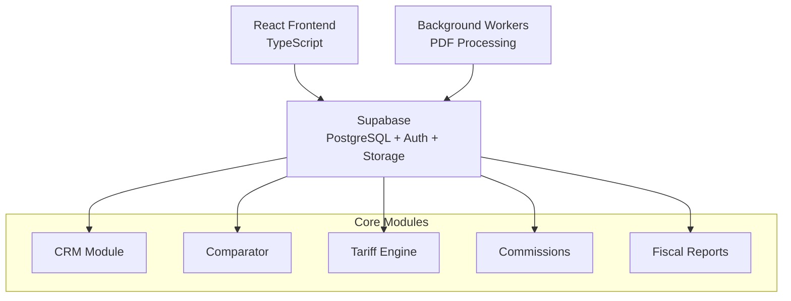
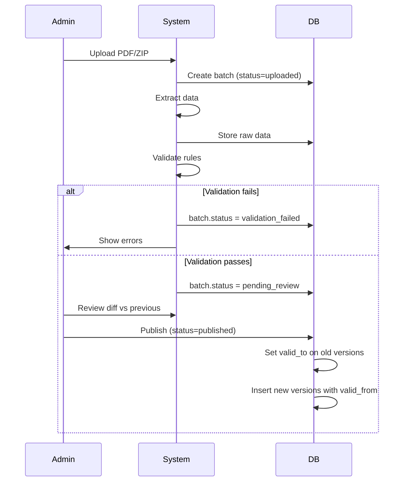
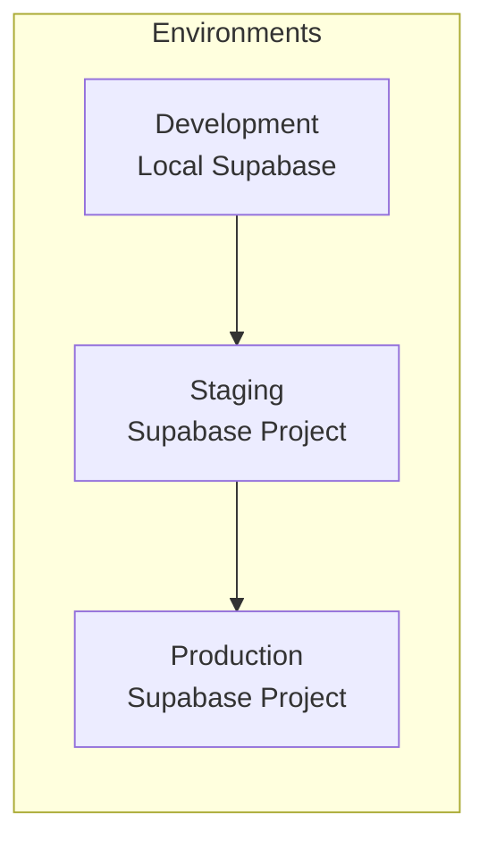

# EnergyDeal CRM - Architecture Document

## Executive Summary

**EnergyDeal CRM** is a multi-tenant B2B SaaS platform for energy comparison, designed for commercial agents to calculate savings, manage customer relationships, and track commissions. The system is built with reproducibility, auditability, and conflict-of-interest transparency as core requirements.

## Core Principles

1. **Multi-Tenant by Design**: Every data entity is scoped to a `company_id`
2. **Audit-First**: All critical actions are logged (who/when/what)
3. **Reproducibility**: Historical calculations can be reconstructed from snapshots
4. **Data Integrity**: No publication without validation + human review
5. **Transparency**: Conflict of interest (commercial-first mode) is explicit

## System Architecture

### High-Level Diagram



## Domain Model

### 1. Multi-Tenancy & Auth Domain

**Entities:**
- **companies** (tenants): The root entity for multi-tenancy
- **users**: Authenticated users belonging to companies with roles
- **audit_log**: Complete action history

**Key Decisions:**
- CIF (Spanish Tax ID) is the unique identifier for companies
- Row-Level Security (RLS) enforces company_id scoping
- All tables (except auth) have `company_id` foreign key

### 2. CRM Domain

**Entities:**
- **customers**: B2B companies (identified by CIF)
- **contacts**: People at customer companies
- **supply_points**: Physical locations with energy meters
- **activities**: Interaction history (calls, emails, meetings)

**Key Decisions:**
- Customer CIF is the primary identifier (not email)
- Lead status workflow: prospecto → contactado → calificado → propuesta → cerrado/perdido
- Supply points store: CUPS (energy meter ID), address, consumption history

### 3. Tariff Engine Domain

**Entities:**
- **tariff_batches**: Upload sessions for tariff updates
- **tariff_files**: Individual PDFs within a batch
- **tariff_versions**: Versioned tariff data (valid_from, valid_to)
- **tariff_components**: Price components (energy, power, taxes, etc.)

**Key Decisions:**
- Tariffs are NEVER overwritten; new versions are created
- Each version has `(valid_from, valid_to, batch_id)` for time-travel queries
- Pipeline: Upload → Parse → Normalize → Validate → Review → Publish
- Batch states: `uploaded → processing → validation_failed → pending_review → published`

**Tariff Versioning Strategy:**


### 4. Comparator Domain

**Entities:**
- **comparisons**: Saved comparison requests + results snapshot
- **comparison_inputs**: Structured input data (CIF, consumption, power, etc.)
- **comparison_results**: Ranked offers with savings calculations

**Key Decisions:**
- Every comparison is saved for audit (even if not converted)
- Mode flag: `client_first` (default) vs `commercial_first`
- Results include: tariff_version_id, monthly_cost, annual_savings, rank
- Snapshot approach: results are denormalized for reproducibility

**Calculation Flow:**


### 5. Contracts & Commissions Domain

**Entities:**
- **contracts**: Signed deals from comparisons
- **commission_rules**: % per commercial, optionally by company/product
- **commission_events**: Individual commission entries
- **payouts**: Monthly settlements

**Key Decisions:**
- Commission events have states: `pending → validated → paid → reverted`
- Rules cascade: specific (company+product) overrides default (commercial %)
- Payouts are immutable once generated; corrections create reversal events
- Every contract references the original `comparison_id` for traceability

### 6. Fiscal Domain

**Entities:**
- **fiscal_exports**: Generated reports (VAT, payments)
- **fiscal_lines**: Individual line items for exports

**Key Decisions:**
- This is NOT a tax filing system; it's export-only for accountants
- Exports are timestamped and immutable
- All data comes from audit_log + commission_events + contracts

## Technology Stack

### Frontend
- **Framework**: React 18+ with TypeScript
- **Structure**: Feature-based modules (src/features/crm, src/features/comparator, etc.)
- **State**: React Query for server state, Zustand for UI state
- **UI Library**: Shadcn/ui (Radix + Tailwind)
- **Forms**: React Hook Form + Zod validation

### Backend
- **Database**: Supabase (PostgreSQL 15+)
- **Auth**: Supabase Auth with magic links + password
- **Storage**: Supabase Storage for PDFs
- **API**: Supabase auto-generated REST + Realtime
- **Edge Functions**: Supabase Edge Functions for background jobs

### Infrastructure
- **Hosting**: Vercel (frontend) + Supabase Cloud (backend)
- **Jobs**: Supabase pg_cron for scheduled tasks
- **Monitoring**: Sentry (errors) + PostHog (analytics)
- **CI/CD**: GitHub Actions

## Data Flow Patterns

### Multi-Tenant Data Access

All queries are scoped via RLS policies:

```sql
-- Example RLS policy
CREATE POLICY "Users can only access their company's data"
ON customers
FOR ALL
USING (company_id = auth.company_id());
```

### Audit Logging

Every critical action generates an audit entry:

```typescript
await auditLog({
  company_id: user.company_id,
  user_id: user.id,
  action: 'tariff.published',
  entity_type: 'tariff_batch',
  entity_id: batch.id,
  metadata: { previous_status: 'pending_review', new_status: 'published' }
});
```

## Non-Functional Requirements

### Performance
- Comparison calculations: < 500ms for up to 50 tariffs
- Batch processing: handle 100 PDFs in < 10 minutes
- UI responsiveness: < 100ms for all interactions

### Security
- RLS enforces tenant isolation
- API keys are access-controlled via Supabase
- PDFs are stored with signed URLs (short-lived)
- All passwords are hashed with bcrypt

### Scalability
- Target: 100 companies, 1000 users, 10k comparisons/month
- Database: partitioning by company_id if needed
- Storage: S3-backed via Supabase

### Compliance
- GDPR: data export + deletion workflows
- Audit retention: 7 years minimum
- Data encryption at rest and in transit

## Migration Strategy

1. **Phase 1**: Core tables + auth
2. **Phase 2**: Tariff engine + batch pipeline
3. **Phase 3**: Messaging & Campaigns (CRM Adaptation)
4. **Phase 4**: Basic Comparator
5. **Phase 5**: Seed data + RLS policies

## Deployment Architecture



## Decision Log

| Decision | Rationale | Trade-offs |
|----------|-----------|------------|
| Supabase over custom backend | Faster MVP, built-in auth + RLS | Less control over query optimization |
| Versioned tariffs (no updates) | Reproducibility requirement | Storage overhead |
| Denormalized comparison snapshots | Audit + reproducibility | Data duplication |
| Feature-based frontend structure | Better modularity for team growth | More initial setup |
| PostgreSQL + RLS for multi-tenancy | Database-level isolation | Complex policies |

## Future Considerations

- **AI-powered tariff extraction**: Replace manual PDF parsing with GPT-4 Vision
- **Mobile app**: React Native for field sales
- **Integrations**: CRM connectors (HubSpot, Salesforce)
- **Advanced analytics**: Power BI / Metabase dashboards
- **White-labeling**: Multi-brand support

## Glossary

- **CIF**: Tax identification number for Spanish companies
- **CUPS**: Universal Supply Point Code (energy meter identifier)
- **Tariff**: Price structure from an energy supplier
- **Batch**: A set of tariff uploads processed together
- **Snapshot**: Frozen state of a calculation for reproducibility
- **RLS**: Row-Level Security in PostgreSQL
