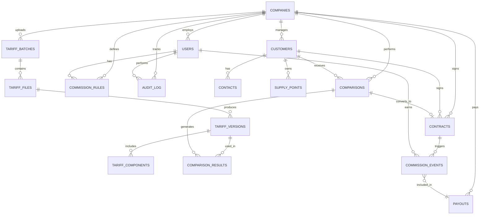

# EnergyDeal CRM - Database Schema

## Overview

This document describes the complete database schema for EnergyDeal CRM, organized by domain.

## Schema Diagram



## Domain: Multi-Tenancy & Auth

### companies

Root entity for multi-tenant isolation.

| Column | Type | Constraints | Description |
|--------|------|-------------|-------------|
| id | UUID | PRIMARY KEY | Unique identifier |
| cif | VARCHAR(9) | UNIQUE NOT NULL | Spanish Tax ID |
| name | VARCHAR(200) | NOT NULL | Company name |
| email | VARCHAR(255) | NOT NULL | Contact email |
| phone | VARCHAR(20) | | Contact phone |
| address | TEXT | | Physical address |
| status | VARCHAR(20) | NOT NULL DEFAULT 'active' | active, suspended, cancelled |
| subscription_tier | VARCHAR(50) | | basic, pro, enterprise |
| created_at | TIMESTAMPTZ | NOT NULL DEFAULT now() | Creation timestamp |
| updated_at | TIMESTAMPTZ | NOT NULL DEFAULT now() | Last update timestamp |

**Indexes:**
- `idx_companies_cif` on (cif)
- `idx_companies_status` on (status)

**Notes:**
- CIF format: 1 letter + 8 digits (e.g., A12345678)
- This table does NOT have RLS (it's the root of multi-tenancy)

---

### users

Authenticated users belonging to companies.

| Column | Type | Constraints | Description |
|--------|------|-------------|-------------|
| id | UUID | PRIMARY KEY | Supabase auth.users.id |
| company_id | UUID | FK companies(id) NOT NULL | Tenant scope |
| email | VARCHAR(255) | UNIQUE NOT NULL | Login email |
| full_name | VARCHAR(200) | NOT NULL | User's full name |
| role | VARCHAR(50) | NOT NULL | admin, manager, commercial, viewer |
| status | VARCHAR(20) | NOT NULL DEFAULT 'active' | active, inactive |
| commission_default_pct | DECIMAL(5,2) | | Default commission % |
| created_at | TIMESTAMPTZ | NOT NULL DEFAULT now() | Creation timestamp |
| updated_at | TIMESTAMPTZ | NOT NULL DEFAULT now() | Last update timestamp |

**Indexes:**
- `idx_users_company_id` on (company_id)
- `idx_users_email` on (email)
- `idx_users_role` on (role)

**RLS Policies:**
- Users can only see users from their own company

---

### audit_log

Complete action history for compliance and debugging.

| Column | Type | Constraints | Description |
|--------|------|-------------|-------------|
| id | UUID | PRIMARY KEY | Unique identifier |
| company_id | UUID | FK companies(id) NOT NULL | Tenant scope |
| user_id | UUID | FK users(id) | User who performed action (nullable for system) |
| action | VARCHAR(100) | NOT NULL | Action identifier (e.g., "tariff.published") |
| entity_type | VARCHAR(50) | NOT NULL | Table name (e.g., "tariff_batch") |
| entity_id | UUID | | ID of affected entity |
| metadata | JSONB | | Additional context |
| ip_address | INET | | Client IP address |
| user_agent | TEXT | | Browser user agent |
| created_at | TIMESTAMPTZ | NOT NULL DEFAULT now() | When action occurred |

**Indexes:**
- `idx_audit_log_company_id` on (company_id)
- `idx_audit_log_user_id` on (user_id)
- `idx_audit_log_action` on (action)
- `idx_audit_log_entity` on (entity_type, entity_id)
- `idx_audit_log_created_at` on (created_at DESC)

**RLS Policies:**
- Admins and managers can view their company's audit log

---

## Domain: CRM

### customers

B2B companies (identified by CIF).

| Column | Type | Constraints | Description |
|--------|------|-------------|-------------|
| id | UUID | PRIMARY KEY | Unique identifier |
| company_id | UUID | FK companies(id) NOT NULL | Tenant scope |
| cif | VARCHAR(9) | NOT NULL | Customer's Tax ID |
| name | VARCHAR(200) | NOT NULL | Customer company name |
| industry | VARCHAR(100) | | Industry sector |
| employee_count | INTEGER | | Number of employees |
| annual_revenue | DECIMAL(12,2) | | Annual revenue in EUR |
| website | VARCHAR(255) | | Company website |
| address | TEXT | | Physical address |
| postal_code | VARCHAR(10) | | Postal code |
| city | VARCHAR(100) | | City |
| province | VARCHAR(100) | | Province |
| status | VARCHAR(50) | NOT NULL DEFAULT 'prospecto' | Lead status |
| assigned_to | UUID | FK users(id) | Assigned commercial |
| created_at | TIMESTAMPTZ | NOT NULL DEFAULT now() | Creation timestamp |
| updated_at | TIMESTAMPTZ | NOT NULL DEFAULT now() | Last update timestamp |

**Unique Constraint:**
- (company_id, cif) - Ensures unique CIF per tenant

**Lead Status Values:**
- prospecto (lead)
- contactado (contacted)
- calificado (qualified)
- propuesta (proposal sent)
- negociacion (negotiation)
- cerrado (won)
- perdido (lost)

**Indexes:**
- `idx_customers_company_id` on (company_id)
- `idx_customers_cif` on (cif)
- `idx_customers_status` on (status)
- `idx_customers_assigned_to` on (assigned_to)

**RLS Policies:**
- Users can access customers from their company

---

### contacts

People at customer companies.

| Column | Type | Constraints | Description |
|--------|------|-------------|-------------|
| id | UUID | PRIMARY KEY | Unique identifier |
| company_id | UUID | FK companies(id) NOT NULL | Tenant scope |
| customer_id | UUID | FK customers(id) NOT NULL | Parent customer |
| first_name | VARCHAR(100) | NOT NULL | First name |
| last_name | VARCHAR(100) | NOT NULL | Last name |
| email | VARCHAR(255) | | Email address |
| phone | VARCHAR(20) | | Phone number |
| position | VARCHAR(100) | | Job title |
| is_primary | BOOLEAN | NOT NULL DEFAULT false | Primary contact flag |
| created_at | TIMESTAMPTZ | NOT NULL DEFAULT now() | Creation timestamp |
| updated_at | TIMESTAMPTZ | NOT NULL DEFAULT now() | Last update timestamp |

**Indexes:**
- `idx_contacts_company_id` on (company_id)
- `idx_contacts_customer_id` on (customer_id)
- `idx_contacts_email` on (email)

**RLS Policies:**
- Users can access contacts from their company's customers

---

### supply_points

Physical locations with energy meters (CUPS).

| Column | Type | Constraints | Description |
|--------|------|-------------|-------------|
| id | UUID | PRIMARY KEY | Unique identifier |
| company_id | UUID | FK companies(id) NOT NULL | Tenant scope |
| customer_id | UUID | FK customers(id) NOT NULL | Parent customer |
| cups | VARCHAR(22) | | Universal Supply Point Code |
| address | TEXT | NOT NULL | Physical address |
| postal_code | VARCHAR(10) | | Postal code |
| city | VARCHAR(100) | | City |
| province | VARCHAR(100) | | Province |
| annual_consumption_kwh | DECIMAL(12,2) | | Annual consumption in kWh |
| contracted_power_kw | DECIMAL(8,2) | | Contracted power in kW |
| current_supplier | VARCHAR(200) | | Current energy supplier |
| current_tariff_name | VARCHAR(200) | | Current tariff name |
| tariff_type | VARCHAR(50) | | 2.0TD, 3.0TD, 6.1TD, etc. |
| created_at | TIMESTAMPTZ | NOT NULL DEFAULT now() | Creation timestamp |
| updated_at | TIMESTAMPTZ | NOT NULL DEFAULT now() | Last update timestamp |

**Indexes:**
- `idx_supply_points_company_id` on (company_id)
- `idx_supply_points_customer_id` on (customer_id)
- `idx_supply_points_cups` on (cups)

**RLS Policies:**
- Users can access supply points from their company's customers

---

### activities

Interaction history (calls, emails, meetings).

| Column | Type | Constraints | Description |
|--------|------|-------------|-------------|
| id | UUID | PRIMARY KEY | Unique identifier |
| company_id | UUID | FK companies(id) NOT NULL | Tenant scope |
| customer_id | UUID | FK customers(id) NOT NULL | Related customer |
| user_id | UUID | FK users(id) NOT NULL | User who logged activity |
| activity_type | VARCHAR(50) | NOT NULL | call, email, meeting, note |
| subject | VARCHAR(200) | NOT NULL | Activity subject |
| description | TEXT | | Detailed description |
| occurred_at | TIMESTAMPTZ | NOT NULL | When activity occurred |
| created_at | TIMESTAMPTZ | NOT NULL DEFAULT now() | Creation timestamp |

**Indexes:**
- `idx_activities_company_id` on (company_id)
- `idx_activities_customer_id` on (customer_id)
- `idx_activities_user_id` on (user_id)
- `idx_activities_occurred_at` on (occurred_at DESC)

**RLS Policies:**
- Users can access activities from their company's customers

---

## Domain: Tariff Engine

### tariff_batches

Upload sessions for tariff updates (every ~15 days).

| Column | Type | Constraints | Description |
|--------|------|-------------|-------------|
| id | UUID | PRIMARY KEY | Unique identifier |
| company_id | UUID | FK companies(id) NOT NULL | Tenant scope |
| uploaded_by | UUID | FK users(id) NOT NULL | User who uploaded |
| status | VARCHAR(50) | NOT NULL DEFAULT 'uploaded' | Batch status |
| file_count | INTEGER | NOT NULL DEFAULT 0 | Number of files in batch |
| validation_errors | JSONB | | Validation error details |
| reviewed_by | UUID | FK users(id) | User who reviewed |
| reviewed_at | TIMESTAMPTZ | | Review timestamp |
| published_by | UUID | FK users(id) | User who published |
| published_at | TIMESTAMPTZ | | Publication timestamp |
| created_at | TIMESTAMPTZ | NOT NULL DEFAULT now() | Creation timestamp |
| updated_at | TIMESTAMPTZ | NOT NULL DEFAULT now() | Last update timestamp |

**Batch Status Values:**
- uploaded (files uploaded, not processed)
- processing (extraction in progress)
- validation_failed (automatic checks failed)
- pending_review (awaiting human review)
- published (live for comparisons)

**Indexes:**
- `idx_tariff_batches_company_id` on (company_id)
- `idx_tariff_batches_status` on (status)
- `idx_tariff_batches_created_at` on (created_at DESC)

**RLS Policies:**
- Admins and managers can manage batches

---

### tariff_files

Individual PDFs or data files within a batch.

| Column | Type | Constraints | Description |
|--------|------|-------------|-------------|
| id | UUID | PRIMARY KEY | Unique identifier |
| company_id | UUID | FK companies(id) NOT NULL | Tenant scope |
| batch_id | UUID | FK tariff_batches(id) NOT NULL | Parent batch |
| filename | VARCHAR(255) | NOT NULL | Original filename |
| storage_path | TEXT | NOT NULL | Supabase Storage path |
| file_size_bytes | BIGINT | | File size |
| mime_type | VARCHAR(100) | | MIME type |
| extraction_status | VARCHAR(50) | NOT NULL DEFAULT 'pending' | Extraction status |
| extracted_data | JSONB | | Raw extracted data |
| extraction_error | TEXT | | Error message if failed |
| created_at | TIMESTAMPTZ | NOT NULL DEFAULT now() | Creation timestamp |

**Extraction Status Values:**
- pending (not processed)
- processing (extraction in progress)
- completed (successfully extracted)
- failed (extraction error)

**Indexes:**
- `idx_tariff_files_company_id` on (company_id)
- `idx_tariff_files_batch_id` on (batch_id)

**RLS Policies:**
- Same as tariff_batches

---

### tariff_versions

Versioned tariff data (immutable, time-scoped).

| Column | Type | Constraints | Description |
|--------|------|-------------|-------------|
| id | UUID | PRIMARY KEY | Unique identifier |
| company_id | UUID | FK companies(id) NOT NULL | Tenant scope |
| batch_id | UUID | FK tariff_batches(id) NOT NULL | Source batch |
| file_id | UUID | FK tariff_files(id) | Source file (nullable if manual) |
| supplier_name | VARCHAR(200) | NOT NULL | Energy supplier |
| tariff_name | VARCHAR(200) | NOT NULL | Tariff name |
| tariff_code | VARCHAR(100) | | Internal code |
| tariff_type | VARCHAR(50) | NOT NULL | 2.0TD, 3.0TD, 6.1TD, etc. |
| valid_from | DATE | NOT NULL | Start date of validity |
| valid_to | DATE | | End date (NULL = active) |
| is_active | BOOLEAN | NOT NULL DEFAULT true | Currently active |
| created_at | TIMESTAMPTZ | NOT NULL DEFAULT now() | Creation timestamp |
| updated_at | TIMESTAMPTZ | NOT NULL DEFAULT now() | Last update timestamp |

**Unique Constraint:**
- (company_id, supplier_name, tariff_name, valid_from) - Prevents duplicate versions

**Indexes:**
- `idx_tariff_versions_company_id` on (company_id)
- `idx_tariff_versions_active` on (is_active) WHERE is_active = true
- `idx_tariff_versions_validity` on (valid_from, valid_to)
- `idx_tariff_versions_supplier` on (supplier_name)

**RLS Policies:**
- All users can read active tariffs from their company

---

### tariff_components

Price components (energy, power, taxes, discounts).

| Column | Type | Constraints | Description |
|--------|------|-------------|-------------|
| id | UUID | PRIMARY KEY | Unique identifier |
| company_id | UUID | FK companies(id) NOT NULL | Tenant scope |
| tariff_version_id | UUID | FK tariff_versions(id) NOT NULL | Parent tariff |
| component_type | VARCHAR(50) | NOT NULL | Type of component |
| period | VARCHAR(50) | | Time period (P1, P2, P3, etc.) |
| price_eur_kwh | DECIMAL(10,6) | | Price per kWh |
| price_eur_kw_year | DECIMAL(10,2) | | Price per kW/year |
| fixed_price_eur_month | DECIMAL(10,2) | | Fixed monthly price |
| tax_pct | DECIMAL(5,2) | | Tax percentage |
| created_at | TIMESTAMPTZ | NOT NULL DEFAULT now() | Creation timestamp |

**Component Types:**
- energy_price (variable cost per kWh)
- power_price (fixed cost per kW)
- fixed_fee (monthly fixed fee)
- tax (IVA, electricity tax)
- discount (promotional discount)

**Indexes:**
- `idx_tariff_components_version_id` on (tariff_version_id)
- `idx_tariff_components_type` on (component_type)

**RLS Policies:**
- Same as tariff_versions

---

## Domain: Comparator

### comparisons

Saved comparison requests + results snapshot.

| Column | Type | Constraints | Description |
|--------|------|-------------|-------------|
| id | UUID | PRIMARY KEY | Unique identifier |
| company_id | UUID | FK companies(id) NOT NULL | Tenant scope |
| customer_id | UUID | FK customers(id) | Related customer (nullable) |
| supply_point_id | UUID | FK supply_points(id) | Related supply point (nullable) |
| performed_by | UUID | FK users(id) NOT NULL | Commercial who ran comparison |
| mode | VARCHAR(50) | NOT NULL DEFAULT 'client_first' | Comparison mode |
| inputs_snapshot | JSONB | NOT NULL | Input data snapshot |
| results_count | INTEGER | NOT NULL DEFAULT 0 | Number of results |
| created_at | TIMESTAMPTZ | NOT NULL DEFAULT now() | Creation timestamp |

**Comparison Modes:**
- client_first (optimize for customer savings)
- commercial_first (optimize for commission)

**inputs_snapshot Schema:**
```json
{
  "cif": "A12345678",
  "customer_type": "empresa",
  "postal_code": "28001",
  "annual_consumption_kwh": 50000,
  "contracted_power_kw": 10.5,
  "current_tariff": "Tarifa A",
  "tariff_type": "2.0TD"
}
```

**Indexes:**
- `idx_comparisons_company_id` on (company_id)
- `idx_comparisons_customer_id` on (customer_id)
- `idx_comparisons_performed_by` on (performed_by)
- `idx_comparisons_created_at` on (created_at DESC)

**RLS Policies:**
- Users can access comparisons from their company

---

### comparison_results

Ranked offers with savings calculations (denormalized snapshot).

| Column | Type | Constraints | Description |
|--------|------|-------------|-------------|
| id | UUID | PRIMARY KEY | Unique identifier |
| company_id | UUID | FK companies(id) NOT NULL | Tenant scope |
| comparison_id | UUID | FK comparisons(id) NOT NULL | Parent comparison |
| tariff_version_id | UUID | FK tariff_versions(id) NOT NULL | Tariff used |
| rank | INTEGER | NOT NULL | Position in ranking (1 = best) |
| annual_cost_eur | DECIMAL(10,2) | NOT NULL | Calculated annual cost |
| monthly_cost_eur | DECIMAL(10,2) | NOT NULL | Calculated monthly cost |
| annual_savings_eur | DECIMAL(10,2) | | Savings vs current (if known) |
| savings_pct | DECIMAL(5,2) | | Savings percentage |
| commission_eur | DECIMAL(10,2) | | Estimated commission |
| calculation_breakdown | JSONB | NOT NULL | Detailed calculation |
| created_at | TIMESTAMPTZ | NOT NULL DEFAULT now() | Creation timestamp |

**calculation_breakdown Schema:**
```json
{
  "energy_cost": 750.00,
  "power_cost": 480.00,
  "fixed_fee": 12.00,
  "subtotal": 1242.00,
  "taxes": 261.82,
  "total": 1503.82
}
```

**Indexes:**
- `idx_comparison_results_comparison_id` on (comparison_id)
- `idx_comparison_results_tariff_version_id` on (tariff_version_id)

**RLS Policies:**
- Same as comparisons

---

## Domain: Contracts & Commissions

### contracts

Signed deals from comparisons.

| Column | Type | Constraints | Description |
|--------|------|-------------|-------------|
| id | UUID | PRIMARY KEY | Unique identifier |
| company_id | UUID | FK companies(id) NOT NULL | Tenant scope |
| customer_id | UUID | FK customers(id) NOT NULL | Customer who signed |
| supply_point_id | UUID | FK supply_points(id) | Supply point |
| comparison_id | UUID | FK comparisons(id) | Original comparison |
| comparison_result_id | UUID | FK comparison_results(id) | Selected offer |
| commercial_id | UUID | FK users(id) NOT NULL | Commercial who closed |
| tariff_version_id | UUID | FK tariff_versions(id) NOT NULL | Signed tariff |
| contract_number | VARCHAR(100) | | External contract ID |
| status | VARCHAR(50) | NOT NULL DEFAULT 'pending' | Contract status |
| signed_at | DATE | | Date signed by customer |
| activation_date | DATE | | Supplier activation date |
| cancellation_date | DATE | | If cancelled |
| annual_value_eur | DECIMAL(10,2) | NOT NULL | Contract annual value |
| commission_eur | DECIMAL(10,2) | | Total commission amount |
| notes | TEXT | | Additional notes |
| created_at | TIMESTAMPTZ | NOT NULL DEFAULT now() | Creation timestamp |
| updated_at | TIMESTAMPTZ | NOT NULL DEFAULT now() | Last update timestamp |

**Contract Status Values:**
- pending (awaiting customer signature)
- signed (customer signed, awaiting activation)
- active (supplier activated)
- cancelled (contract cancelled)
- completed (contract ended normally)

**Indexes:**
- `idx_contracts_company_id` on (company_id)
- `idx_contracts_customer_id` on (customer_id)
- `idx_contracts_commercial_id` on (commercial_id)
- `idx_contracts_status` on (status)
- `idx_contracts_signed_at` on (signed_at DESC)

**RLS Policies:**
- Users can access contracts from their company

---

### commission_rules

Percentage per commercial, optionally by company/product.

| Column | Type | Constraints | Description |
|--------|------|-------------|-------------|
| id | UUID | PRIMARY KEY | Unique identifier |
| company_id | UUID | FK companies(id) NOT NULL | Tenant scope |
| user_id | UUID | FK users(id) NOT NULL | Commercial user |
| supplier_name | VARCHAR(200) | | Specific supplier (NULL = default) |
| tariff_type | VARCHAR(50) | | Specific tariff type (NULL = default) |
| commission_pct | DECIMAL(5,2) | NOT NULL | Commission percentage |
| valid_from | DATE | NOT NULL | Start date |
| valid_to | DATE | | End date (NULL = active) |
| is_active | BOOLEAN | NOT NULL DEFAULT true | Currently active |
| created_at | TIMESTAMPTZ | NOT NULL DEFAULT now() | Creation timestamp |

**Rule Priority (most specific wins):**
1. user_id + supplier_name + tariff_type
2. user_id + supplier_name
3. user_id (default)

**Indexes:**
- `idx_commission_rules_company_id` on (company_id)
- `idx_commission_rules_user_id` on (user_id)
- `idx_commission_rules_active` on (is_active) WHERE is_active = true

**RLS Policies:**
- Admins can manage rules; commercials can view their own

---

### commission_events

Individual commission entries.

| Column | Type | Constraints | Description |
|--------|------|-------------|-------------|
| id | UUID | PRIMARY KEY | Unique identifier |
| company_id | UUID | FK companies(id) NOT NULL | Tenant scope |
| contract_id | UUID | FK contracts(id) NOT NULL | Related contract |
| user_id | UUID | FK users(id) NOT NULL | Commercial who earned it |
| commission_rule_id | UUID | FK commission_rules(id) | Applied rule |
| status | VARCHAR(50) | NOT NULL DEFAULT 'pending' | Event status |
| amount_eur | DECIMAL(10,2) | NOT NULL | Commission amount |
| percentage | DECIMAL(5,2) | NOT NULL | Applied percentage |
| period_month | DATE | NOT NULL | Month for settlement (YYYY-MM-01) |
| validated_by | UUID | FK users(id) | User who validated |
| validated_at | TIMESTAMPTZ | | Validation timestamp |
| notes | TEXT | | Additional notes |
| created_at | TIMESTAMPTZ | NOT NULL DEFAULT now() | Creation timestamp |
| updated_at | TIMESTAMPTZ | NOT NULL DEFAULT now() | Last update timestamp |

**Event Status Values:**
- pending (awaiting validation)
- validated (approved for payment)
- paid (included in payout)
- reverted (cancelled/corrected)

**Indexes:**
- `idx_commission_events_company_id` on (company_id)
- `idx_commission_events_contract_id` on (contract_id)
- `idx_commission_events_user_id` on (user_id)
- `idx_commission_events_status` on (status)
- `idx_commission_events_period` on (period_month DESC)

**RLS Policies:**
- Admins can manage all; commercials can view their own

---

### payouts

Monthly settlements.

| Column | Type | Constraints | Description |
|--------|------|-------------|-------------|
| id | UUID | PRIMARY KEY | Unique identifier |
| company_id | UUID | FK companies(id) NOT NULL | Tenant scope |
| user_id | UUID | FK users(id) NOT NULL | Commercial being paid |
| period_month | DATE | NOT NULL | Settlement month (YYYY-MM-01) |
| total_amount_eur | DECIMAL(10,2) | NOT NULL | Total payout amount |
| event_count | INTEGER | NOT NULL DEFAULT 0 | Number of events |
| status | VARCHAR(50) | NOT NULL DEFAULT 'draft' | Payout status |
| generated_by | UUID | FK users(id) NOT NULL | User who generated |
| paid_by | UUID | FK users(id) | User who marked as paid |
| paid_at | TIMESTAMPTZ | | Payment timestamp |
| payment_method | VARCHAR(50) | | bank_transfer, etc. |
| payment_reference | VARCHAR(100) | | External payment ID |
| notes | TEXT | | Additional notes |
| created_at | TIMESTAMPTZ | NOT NULL DEFAULT now() | Creation timestamp |
| updated_at | TIMESTAMPTZ | NOT NULL DEFAULT now() | Last update timestamp |

**Payout Status Values:**
- draft (being prepared)
- finalized (ready for payment)
- paid (payment completed)

**Unique Constraint:**
- (company_id, user_id, period_month) - One payout per commercial per month

**Indexes:**
- `idx_payouts_company_id` on (company_id)
- `idx_payouts_user_id` on (user_id)
- `idx_payouts_period` on (period_month DESC)
- `idx_payouts_status` on (status)

**RLS Policies:**
- Admins can manage all; commercials can view their own

---

## Domain: Fiscal

### fiscal_exports

Generated reports (VAT, payments).

| Column | Type | Constraints | Description |
|--------|------|-------------|-------------|
| id | UUID | PRIMARY KEY | Unique identifier |
| company_id | UUID | FK companies(id) NOT NULL | Tenant scope |
| export_type | VARCHAR(50) | NOT NULL | vat_report, payment_report |
| period_start | DATE | NOT NULL | Period start date |
| period_end | DATE | NOT NULL | Period end date |
| generated_by | UUID | FK users(id) NOT NULL | User who generated |
| file_path | TEXT | | Exported file path |
| line_count | INTEGER | NOT NULL DEFAULT 0 | Number of lines |
| metadata | JSONB | | Additional export metadata |
| created_at | TIMESTAMPTZ | NOT NULL DEFAULT now() | Creation timestamp |

**Export Types:**
- vat_report (for VAT filing)
- payment_report (commercial payments)
- contract_summary (contract list)

**Indexes:**
- `idx_fiscal_exports_company_id` on (company_id)
- `idx_fiscal_exports_type` on (export_type)
- `idx_fiscal_exports_period` on (period_start, period_end)

**RLS Policies:**
- Admins can manage fiscal exports

---

### fiscal_lines

Individual line items for exports.

| Column | Type | Constraints | Description |
|--------|------|-------------|-------------|
| id | UUID | PRIMARY KEY | Unique identifier |
| company_id | UUID | FK companies(id) NOT NULL | Tenant scope |
| export_id | UUID | FK fiscal_exports(id) NOT NULL | Parent export |
| line_number | INTEGER | NOT NULL | Line number in export |
| entity_type | VARCHAR(50) | NOT NULL | contract, commission_event |
| entity_id | UUID | NOT NULL | Related entity ID |
| line_data | JSONB | NOT NULL | Line content |
| created_at | TIMESTAMPTZ | NOT NULL DEFAULT now() | Creation timestamp |

**Indexes:**
- `idx_fiscal_lines_export_id` on (export_id)

**RLS Policies:**
- Same as fiscal_exports

---

## Database Functions

### update_updated_at_column()

Trigger function to auto-update `updated_at` timestamp.

```sql
CREATE OR REPLACE FUNCTION update_updated_at_column()
RETURNS TRIGGER AS $$
BEGIN
  NEW.updated_at = now();
  RETURN NEW;
END;
$$ LANGUAGE plpgsql;
```

### auth.company_id()

Helper function for RLS policies.

```sql
CREATE OR REPLACE FUNCTION auth.company_id()
RETURNS UUID AS $$
  SELECT company_id FROM users WHERE id = auth.uid();
$$ LANGUAGE sql STABLE;
```

---

## Row-Level Security (RLS) Summary

All tables (except `companies`) have RLS enabled with policies scoped to `company_id`.

**Standard Policy Pattern:**
```sql
CREATE POLICY "tenant_isolation"
  ON table_name
  FOR ALL
  USING (company_id = auth.company_id());
```

**Role-Based Policies:**
- Some tables restrict INSERT/UPDATE/DELETE to `admin` or `manager` roles
- Commercials can only view their own commissions/payouts
- All users can view active tariffs

---

## Data Retention

- **audit_log**: 7 years minimum (legal requirement)
- **tariff_versions**: Indefinite (reproducibility)
- **comparisons**: 5 years
- **contracts**: Indefinite (legal requirement)
- **commission_events**: Indefinite (audit trail)
- Other tables: No specific retention policy

---

## Indexes Strategy

- **Multi-tenant scoping**: All tables indexed on `company_id`
- **Foreign keys**: All FKs have indexes
- **Query optimization**: Additional indexes on commonly filtered columns (status, dates)
- **Full-text search**: Consider adding GIN indexes for `tsvector` if text search is needed

---

## Migration Order

1. Core tables: companies, users, audit_log
2. CRM tables: customers, contacts, supply_points, activities
3. Tariff tables: tariff_batches, tariff_files, tariff_versions, tariff_components
4. Comparator tables: comparisons, comparison_results
5. Contract tables: contracts
6. Commission tables: commission_rules, commission_events, payouts
7. Fiscal tables: fiscal_exports, fiscal_lines
8. Functions and triggers
9. RLS policies
10. Seed data
